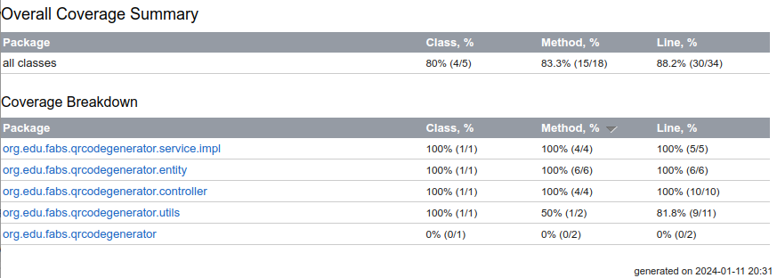

# QRCODE Generator
personal project

--- 

### Technologies:
- linux
- intellij
- java 17
- gradle
- spring data
- spring web
- lombok
- postgresql
- zxing
- openapi
- swagger

## Run Project

--- 

clone the project:
```bash
git clone git@github.com:bianavic/qrcode-generator.git
```
open this project in your preferred IDE


navigate to application directory
```bash
cd qrcode-generator
```
build application
```bash
./gradlew build
```
run the application
```bash
sudo docker-compose up
```
stop the application
```bash
sudo docker-compose down
```

## Swagger: 

---

#### access the documentation
http://localhost:6060/swagger-ui/index.html

## Generate QRCode

---

while project is up

1- make a post-request with your Wi-Fi name and password

2- make a get-request: it will generate the qrcode png file at resources directory


## Routes

---

| API ROUTE		                | DESCRIPTION                   | STATUS |
|:--------------------------------|:------------------------------|:-------|
| [POST] v1/wifi                  | Add a new wifi                | 200    |
| [GET] v1/wifi/{id}              | Retrieve wifi by ID           | 200    |
| [GET] v1/wifi	               | Retrieve all registered wifis | 200    |

---

### add Wi-Fi
```bash
curl --location 'http://localhost:9090/v1/wifi' \
--header 'Content-Type: application/json' \
--data '{
    "wifiName": "test",
    "wifiPassword": "test123"
}'
```
###### 201 CREATED
``` json
{"id":1,"wifiName":"test","wifiPassword":"test123"}
```

### get all registered WiFis
```bash
curl --location 'http://localhost:9090/v1/wifi' \
--data ''
```
###### 200 OK
``` json
[
    {
        "id": 1,
        "wifiName": "test",
        "wifiPassword": "test123"
    }
]
```

### get Wi-Fi by ID
```bash
curl --location 'http://localhost:9090/v1/wifi/1' \
--data ''
```
###### 200 OK
``` json
{
    "id": 1,
    "wifiName": "test",
    "wifiPassword": "test123"
}
```

## Code Coverage Report

---



